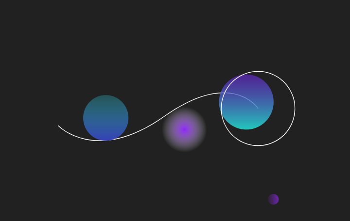

<h1 align="center">
  
    <br>
</h1>

<h4 align="center">
  Angular 9 website with bootstrap 4
</h4>

<p align="center">


</p> 

<p align="center">
  <a href="#computer-technologies">Technologies</a>&nbsp;&nbsp;&nbsp;|&nbsp;&nbsp;&nbsp;
  <a href="#installing-the-application">How to run</a>&nbsp;&nbsp;&nbsp;|&nbsp;&nbsp;&nbsp;
  <a href="#page_facing_up-license">License</a>&nbsp;&nbsp;&nbsp;|&nbsp;&nbsp;&nbsp;
  <a href="#mailbox_with_mail-get-in-touch">Get in touch</a>
</p>
<br><br>

### :computer: Technologies

This project was developed with the following technologies:

-  [Angular](https://angular.io)
-  [TypeScript](https://www.typescriptlang.org)
-  [JavaScript](https://www.javascript.com)
-  [HTML](https://www.w3.org)
-  [Sass](https://sass-lang.com)
-  [CSS](https://www.w3.org/Style/CSS/Overview.en.html)
-  [Bootstrap](https://getbootstrap.com)
-  [jQuery](https://jquery.com)
-  [popper.js](https://popper.js.org)

### Installing the Application
Clone the repository and install the dependencies.
```bash
# to clone the repository
$ git clone https://github.com/Jurfest/bootstrap-course.git

# go into the folder
$ cd Jurfest/bootstrap-course/

#install dependencies
$ npm install

```

### :microscope: A way to inspect the code

After installing VS Code:

```bash
$ code .
```

### Running the application

```bash
$ ng serve
```
Inside the browser:
<p>http://localhost:4200</p>

<!-- 

 -->

### Preview

<!-- <h1 align="center">
    
</h1>
<h1 align="center">
    
</h1> -->

### Acknowledgment

This project is my result after completing the free and online course/tutorial provided by [Ricardo Sanches](https://www.youtube.com/watch?v=VwN9OzoK9o8&list=PLBbHLUbqqCrTwIrdix6kl84m4OPE0JexR&index=2).

### :page_facing_up: License

This project is under the MIT license. 

### :mailbox_with_mail: Get in touch!

[LinkedIn](https://www.linkedin.com/in/diegojurfest/)

### Frontend aditional information

This project was generated with [Angular CLI](https://github.com/angular/angular-cli) version 9.1.1.

### Development server

Run `ng serve` for a dev server. Navigate to `http://localhost:4200/`. The app will automatically reload if you change any of the source files.

### Code scaffolding

Run `ng generate component component-name` to generate a new component. You can also use `ng generate directive|pipe|service|class|guard|interface|enum|module`.

### Build

Run `ng build` to build the project. The build artifacts will be stored in the `dist/` directory. Use the `--prod` flag for a production build.

### Running unit tests

Run `ng test` to execute the unit tests via [Karma](https://karma-runner.github.io).

### Running end-to-end tests

Run `ng e2e` to execute the end-to-end tests via [Protractor](http://www.protractortest.org/).

### Further help

To get more help on the Angular CLI use `ng help` or go check out the [Angular CLI README](https://github.com/angular/angular-cli/blob/master/README.md).


### Thats it ! :wave:

---

by Diego Jurfest :tada:
